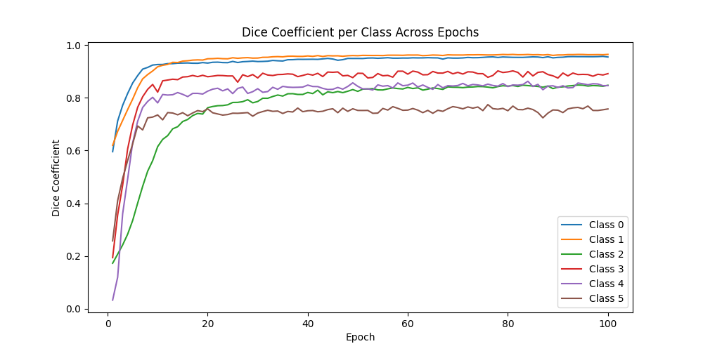
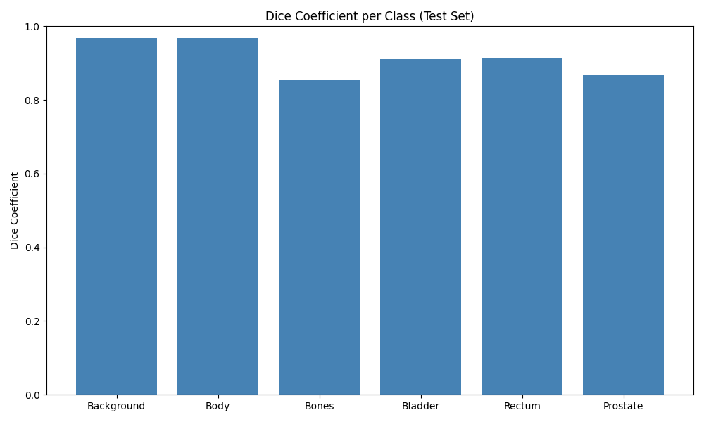

# Prostate Segmentation on HipMRI Using 2D U-Net

By Shannon Dela Pena, 47419111

## Description of the U-Net Algorithm

This project focuses on prostate segmentation from medical MRI scans using a 2D U-Net deep learning architecture.

The U-Net algorithm is a convolutional neural network (CNN) is designed specifically for biomedical image segmentation. [^1] It consists of a contracting path that captures contextual and semantic information by downsampling and an expanding path that restores spatial context by upsampling and skip connections. This structure allows for pixel-level classification of each region. By doing this, U-Net is highly effective in medical image segmentation, as it can adapt to variations of organ size, shape, and position across different patients.

In this project, the same core architecture is adapted and optimised for 2D prostate MRI slices from the HipMRI dataset.

## Objective of Task

The goal of this project is to automatically segment the prostate gland from MRI scans, targeting a Dice Similarity Coefficient (DSC) of >= 0.75, indicating a high degree of overlap between predicted and ground-truth segmentations.

## Methodology

The MRI slice data consisted of images with a resolution of 256 x 128 pixels (H x W). Each corresponding segmentation mask contained six distinct labels, with labels:

- 0 = Background
- 1 = Body
- 2 = Bones
- 3 = Bladder
- 4 = Rectum
- 5 = Prostate

**Data Preparation and Augmentation**

To improve generalisation and prevent overfitting, spatial augmentations such as random rotations and horizontal flip were applied to the MRI slices during training. A study on _Data Augmentations for Prostate Cancer Detection_, [^2] found that small rotational perturbations reflected real world positional variability while keeping anatomical realism, helping the model to generalise better. Horizontal and vertical flips further enhanced robustness by teaching the model that mirrored structures can represent the same anatomical class.

**The U-Net Architecture**

The encoder path uses repeated `DoubleConv` blocks (two 3x3 convolutions, batch normalisation, and ReLU) followed by max-pooling for downsampling. The original U-Net used feature sizes of 64, 128, 256, and 512, but these were reduced to 32, 64, 128, and 256 to better accommodate noisy MRI data.

A `DoubleConv` block in the bottleneck expands the feature maps from 256 to 512 channels, allowing the model to capture broader information such as relative positioning and overall structure of organs.

The decoder mirrors the downsampling process with transposed convolutions for upsampling and skip connections from the encoder. This reconstruction restores spatial information lost during pooling, producing a multi-class segmentation map, which integrates with the combined Focal and Dice Loss for multi-class segmentation training.

**Loss Functions**

A combination of Focal and Dice Loss was used to address class imbalance and improve segmentation of smaller structures. Focal Loss, implemented as an extension of Cross-Entropy Loss, down-weights well-classified pixels while emphasising harder, misclassified ones. This is particularly relevant for the HipMRI dataset, which is highly imbalanced, as most slices lack a visible prostate region. Dice Loss complements this by focusing on region-level overlap and improving boundary precision between different organs.

To compensate for the underrepresentation of smaller regions such as the rectum and prostate, per-class weights were applied to both the focal and dice components. This assigned higher importance to smaller structures while reducing the influence of dominant classes like the background and body.

**Metrics**

The Dice coefficient was computer per class after each epoch to evaluate overlap accuracy.

## Results

### Train



Over 100 epochs, the model achieved consistent convergence across all classes, with Dice coefficients above 0.9 for major regions and stabilising around 0.75 for smaller regions. The slower convergence of classes 4 and 5 highlights the importance of loss weighting and the combined Focal-Dice loss to address class imbalance. The plateauing of Dice scores across all classes indicates that training reached stability and consistent performance.


The plot shows a steep decline in both training and validation losses during the early epochs, indicating that the model quickly learned to distinguish between major tissue regions. After this phase, both curves gradually flatten between epochs 15 and 50. The training loss continues to decrease steadily to approximately 0.45, while validation stabilises around 0.65. The consistent gap in between suggests mild overfitting, likely due to the model's ability to memorise larger structures more effectively than less frequent, smaller regions.

Example predictions at different epochs can be viewed in the `visualisation_train` folder.

### Test

The trained U-Net model was evaluated on a test set of 540 MRI slices. The model achieved a mean Dice coefficient of 0.9137, indicating strong overall segmentation across all regions. Below are class-wise Dice scores:



```
Dice per class: {'Background': 0.969, 'Body': 0.968, 'Bones': 0.854, 'Bladder': 0.91, 'Rectum': 0.913, 'Prostate': 0.868}
Mean Dice coefficient: 0.9137
Dice loss (1 - mean Dice): 0.0863
```

Notably, the prostate region, despite being the smallest and least frequent, achieved a Dice score of 0.868.

Visualisations of test predictions are provided in the `visualisation_test` folder.

## Dependencies

The project was conducted on the Rangpur A100 GPU cluster, using fixed random seed of 7 for reproducibility. The environment was built with the following dependencies:

```
torch==2.7.1+cu118
torchvision==0.22.1+cu118
torchaudio==2.7.1+cu118
numpy==2.1.2
matplotlib==3.10.6
nibabel==5.3.2
scikit-image==0.25.2
tqdm==4.67.1
pillow==11.0.0
scipy==1.16.2
```

## For Future Implementations

Limitations

- The model was trained using only 2D slices, losing some anatomical context

Future work

- Extend the approach to 3D volumetric segmentation
- Incorporate pre-trained encoders for better convergence
- Apply advanced data augmentation techniques, such as elastic deformations as demonstrated in the original U-Net paper to improve generalization
- In training, the plateau after approximately 60 epochs suggests early stopping to shorten training without loss of performance.

## References

1. Aladdin Persson. PyTorch Image Segmentation Tutorial with U-NET [Video]. YouTube. https://www.youtube.com/watch?v=IHq1t7NxS8k
   - Provided a practical walkthrough of U-Net architecture implementation and training in PyTorch
2. DigitalSreeni. 208 - Multiclass semantic segmentation using U-Net [Video].YouTube. https://www.youtube.com/watch?v=XyX5HNuv-xE
   - Provided a practical walkthrough of U-Net architecture implementation with multi-class segmentation in PyTorch

### Footnotes

[^1]: :[^1] Ronneberger, O., Fischer, P., & Brox, T. (2015). _U-Net: Convolutional Networks for Biomedical Image Segmentation_. [https://arxiv.org/abs/1505.04597](https://arxiv.org/abs/1505.04597)
[^2]: Hao, R., Namdar, K., Liu, L., Haider, M. A., & Khalvati, F. (2021). A comprehensive study of data augmentation strategies for prostate cancer detection in diffusion-weighted MRI using convolutional neural networks. Journal of Digital Imaging, 34(4), 862–876. https://doi.org/10.1007/s10278-021-00478-7
